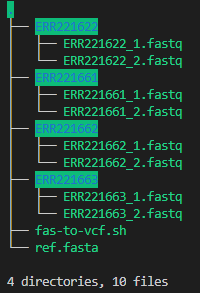
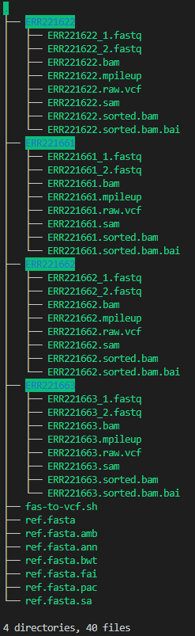

# fas-to-vcf

## Description
This is a Bash script to batch convert FAS files to VCF files using bwa, samtools, and bcftools

## Requirements
samtools 1.9, bcftools 1.9, bwa 0.7.12

## Input
1 reference file, 1 case-sensitive format of sequence files, up to 7 sequence id's

## Command
bash fas-to-vcf.sh ref.fasta fastq ERR221622 ERR221661 ERR221662 ERR221663

## Output
up to 7 VCF files

## Folder Setup
 
